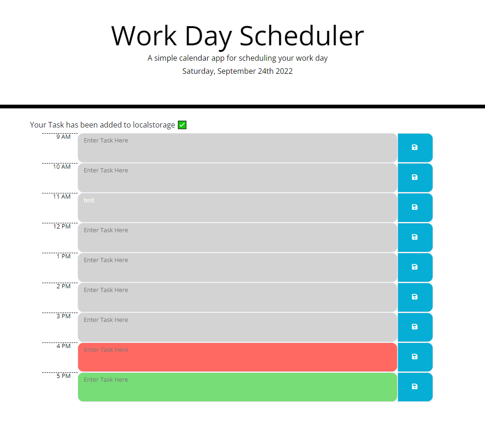

#  Module 5 : Javascript: 3rd Party APIs: JQuery, Bootstrap & Moment

## Overview

I have put together a day planner for an indvidual day broken down into hour slots for a working day (9am-5pm).

## Installation

N/A

## Usage

Upon loading, the page will display the hour slots labeled to the left hand side. The hour slots are fillable and are indicated as such.
The current hour will be colored red, while future hours are green, and past hours are grey.

At the end of the game your score is displayed as well as the ability to enter your name which will be tied to your score in local storage.

### Links

 [Github Page](https://sashdc.github.io/Day-planner/)
 
 [Github Repo](https://github.com/sashdc/Day-planner)

 ## Credits

Cherian, Saharsh

[Creator Github](https://github.com/sashdc)

## License

N/A
